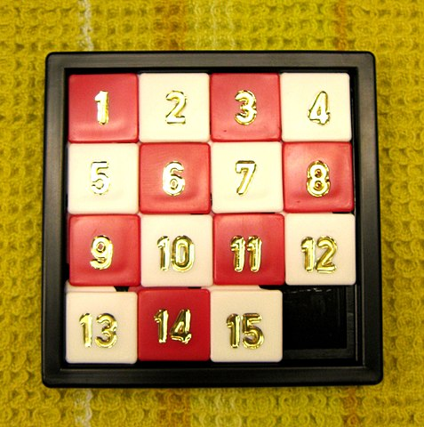

# Tile Game

The Sliding Tile Game is a classic game typically played on a 4x4 board that involves a board like below



<a href="https://commons.wikimedia.org/w/index.php?curid=3104433">Image by Micha L. Rieser</a>

The object of the game is to use the one free space on the board to slide the tiles up, down, left, and right to arrange the tiles in a sorted order.


**Notes**
<hr/>

- If using the metadata object for setting the title of a page, then to get your favicon to display properly you have to add the favicon as 'icon.ico' in the /app directory and add it to the metadata object like so:
```javascript
export const metadata = {
  title: "Tile Game",
  icons: {
    icon: "/favicon.ico"
  }
}
```

&nbsp;&nbsp;&nbsp;&nbsp;&nbsp;&nbsp;&nbsp;&nbsp;&nbsp;&nbsp;&nbsp;&nbsp;Source for this favicon is https://clipart-library.com/clipart/481588.htm

- React concept, adding an event listener for something like a keydown event is best done with useEffect, but *ALSO* remove the event listener on cleanup so that you don't reassign the handler numerous times *AND* the handler will be registered to act on proper state information
